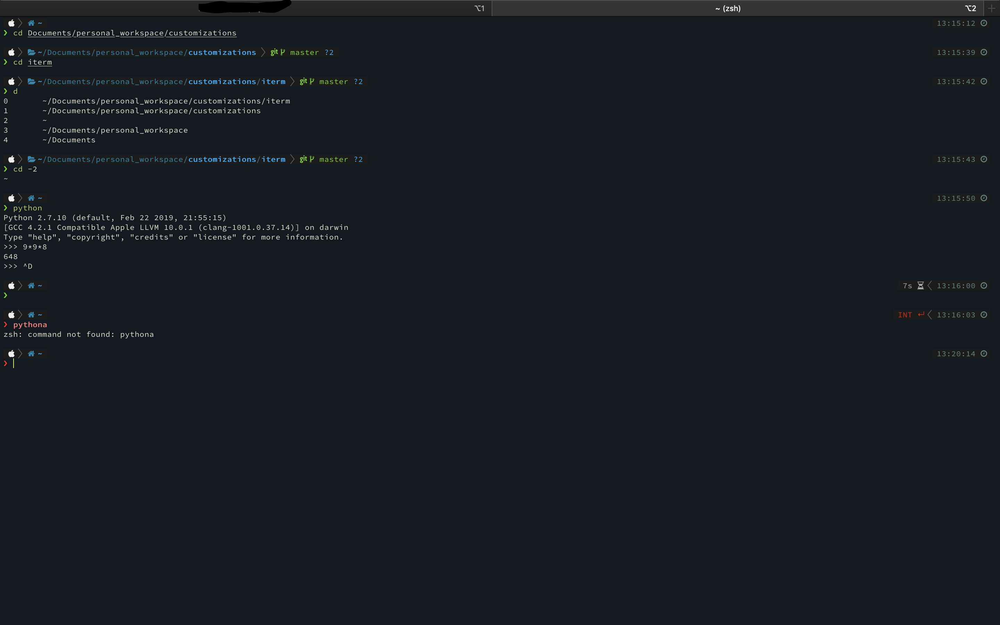
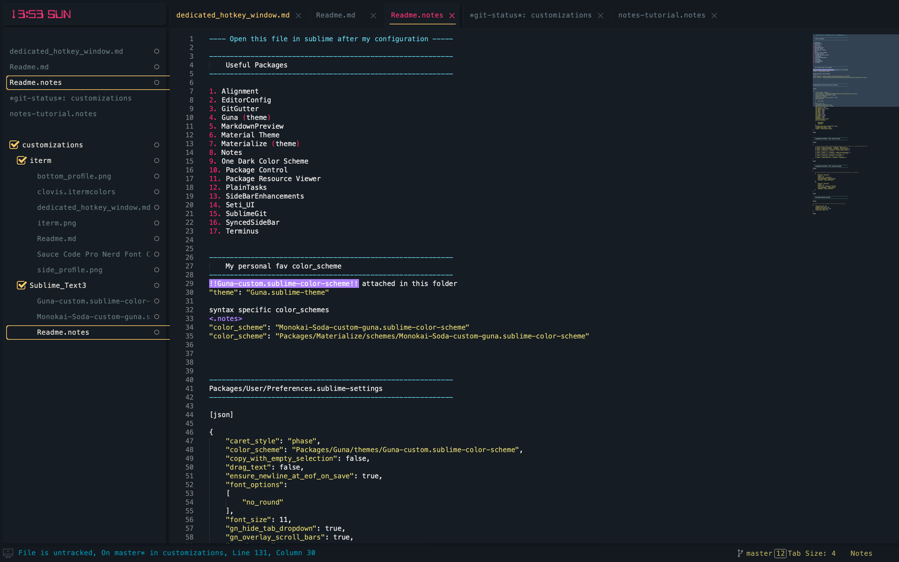

## Awesome-Customizations 
### make your setup beautiful and handy
This repo has
1. A collection of best customizations for various apps like iterm, sublime etc to make them handy and 
   especially beautiful
2. Few handy scripts and alias (coming out soon)  
3. Fonts and required color_scheme, configs and theme files provided in this repo in respective app folder

### few screenshots
#### iterm 

#### sublime text

**Checkout the various apps folder for their readme**
