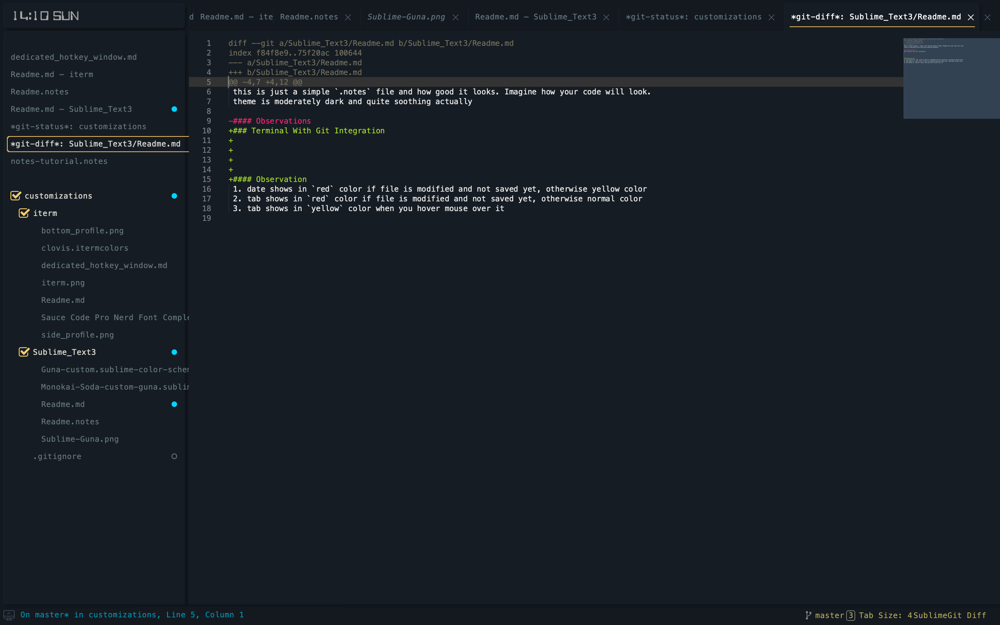
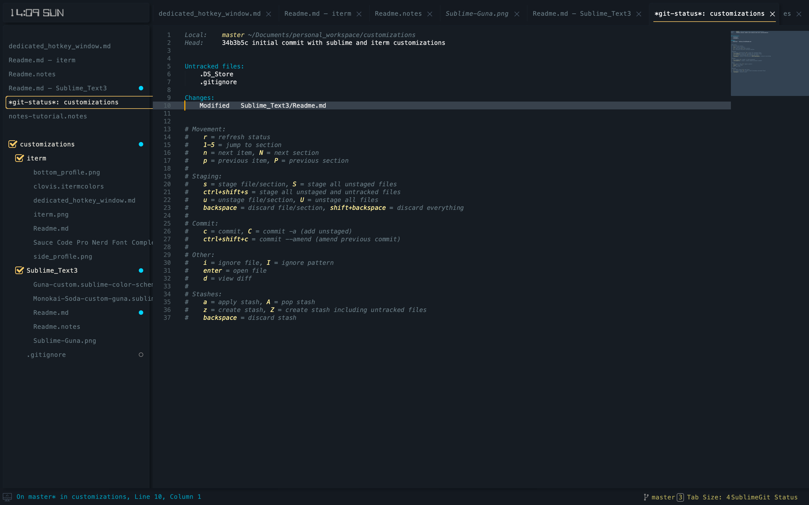

### checkout readme.notes for setup like below

### Make your sublime text beautiful

**Install Guna theme via Package Control** 

### Terminal With Git Integration

#### Git diff view

#### Git status view

#### Observations
0. This is just a simple `.notes` file and how good it looks. Imagine how your code will look.
   theme is moderately dark and quite soothing actually
1. date shows in `red` color if file is modified and not saved yet, otherwise yellow color
2. tab shows in `red` color if file is modified and not saved yet, otherwise normal color
3. tab shows in `yellow` color when you hover mouse over it
4. overall color_scheme and theme is pretty appealing
5. SublimeGit package makes using git pretty awesome using sublime.
6. no need to type commands for adding files for stage and viewing diff. SublimeGit package
   makes it available at a single key press
7. Staged files appear in SideBar with blue circles
8. Untracked files appear in SideBar with empty circles   

