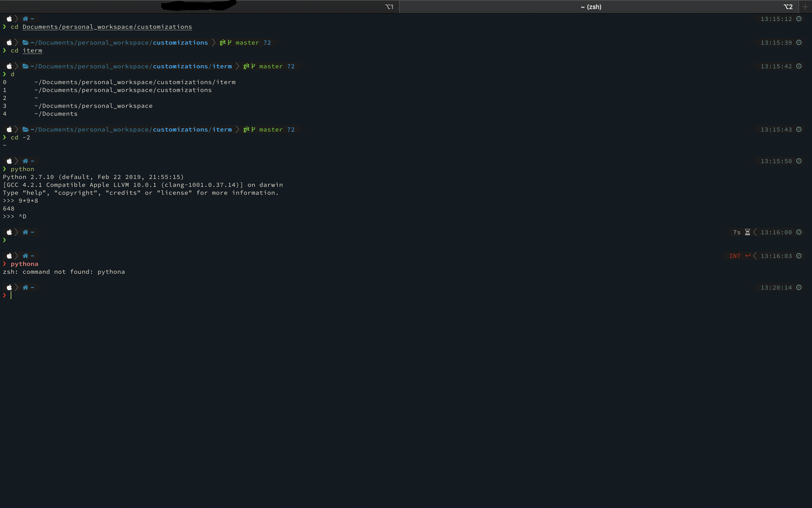
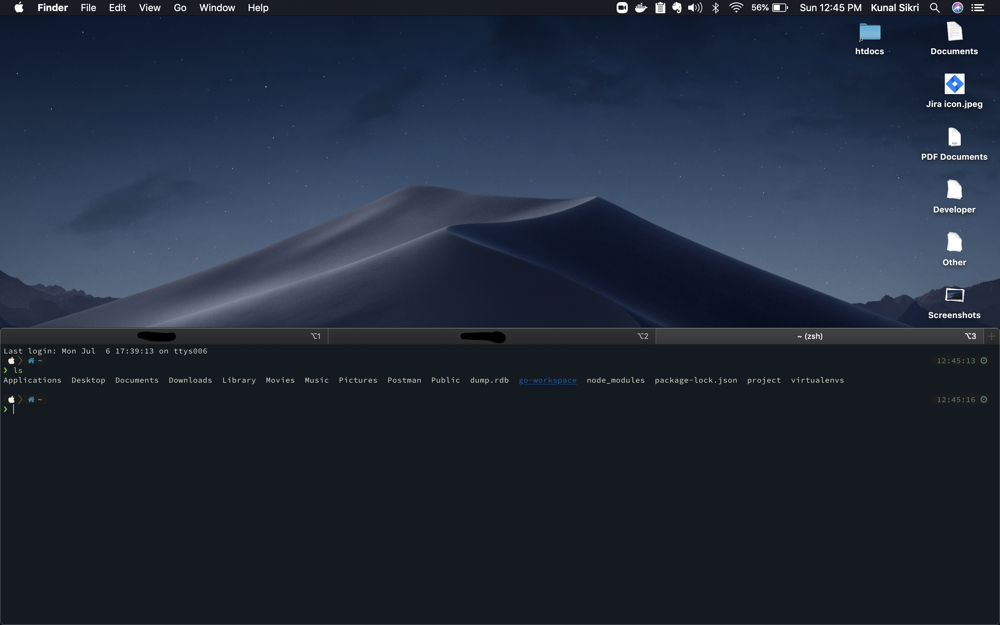

## Make your Iterm beautiful

#### bottom profile view

#### side profile view

### Customizations for iterm
0. use zsh shell and oh_my_zsh
1. install powerline font `SauceCord Pro Nerd Font Complete`
2. use color presets as `cloivs.itermcolors`
3. use powerlevel10k. just google powerlevel10k and install it .
   (above fonts help in rendering images if using powerlevel10k)

### Observations
1. you could see apple, git and directory icons properly rendered
2. wrong command comes in red color
3. time duration and status code returned by previous command comes on right with time

### Go through dedicated_hotkey_window.md file for floating_windows
