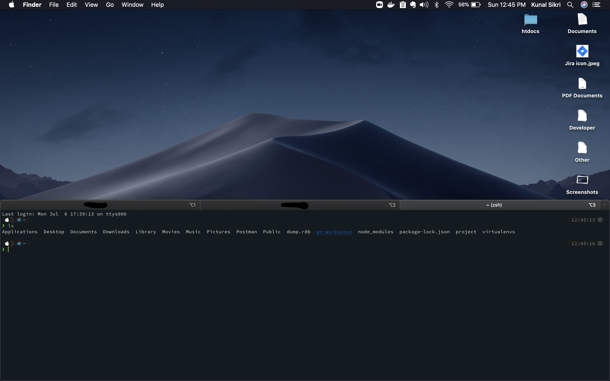

### Steps to create a dedicated hotkey window:
	1. open iterm preferences
	2. goto keys->hotkey->create a dedicated hotkey window
	3. in the new dialog box select floating window and assign a key.
	4. goto profile and setup size,color,location and font for this profile

#### how is this useful
	1. no need to change workspace for terminals.
	2. Sometimes you are just watching videos or seeing code on stackoverflow or somewhere else and 
	you have to switch workspace to enter that command. With dedicated hotkey window , you can do it 
	in same workspace
	3. this is also helpful for commands that run in background . just run it in dedicated window and
	press hotkey to hide this window after command is run

#### bottom profile view

#### side profile view

		
